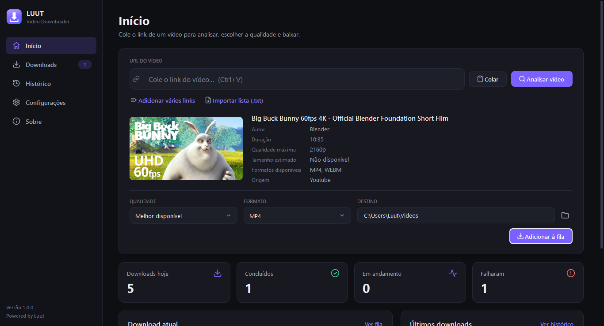
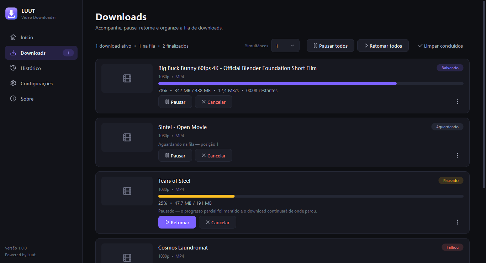
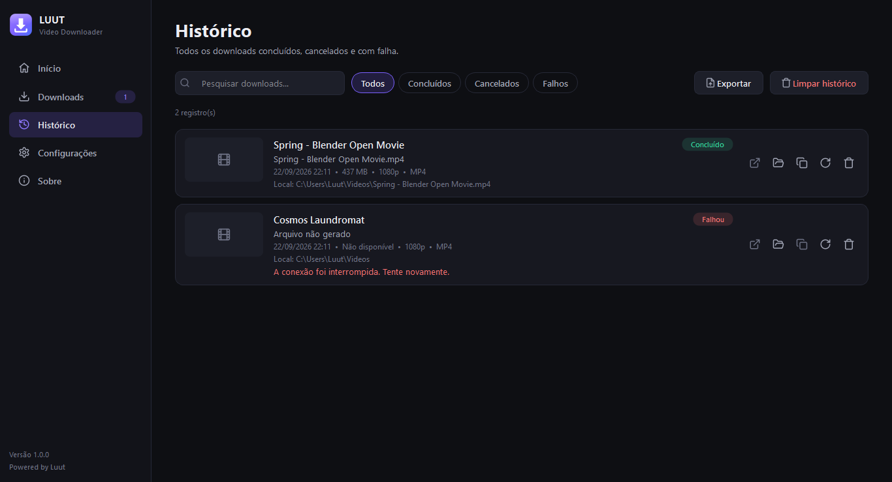
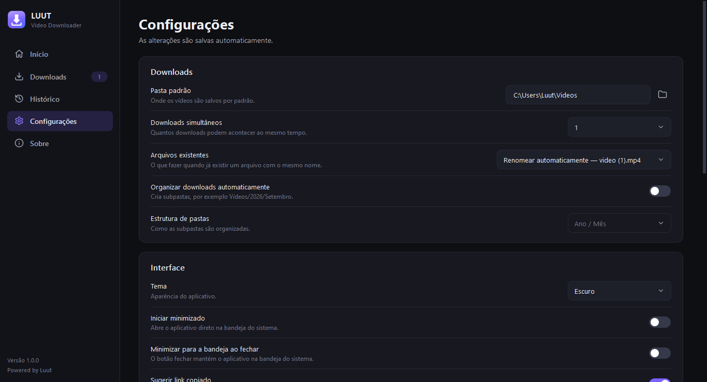
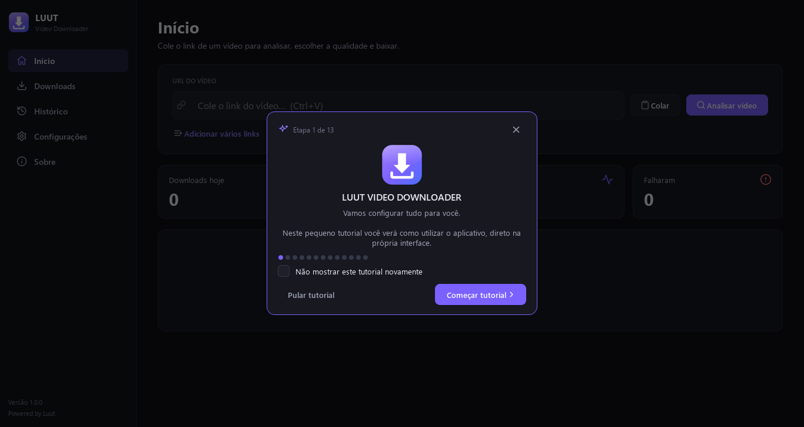
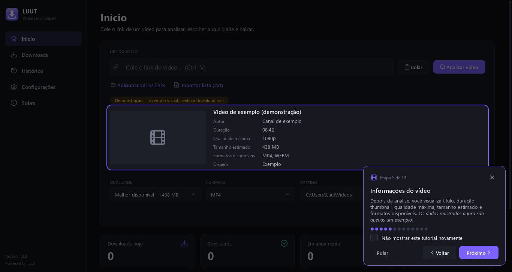
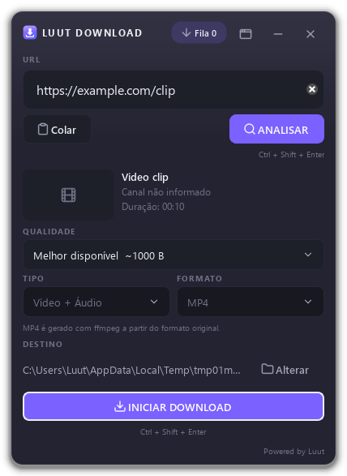
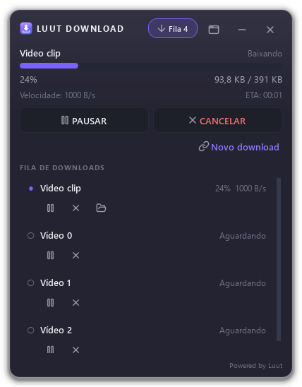
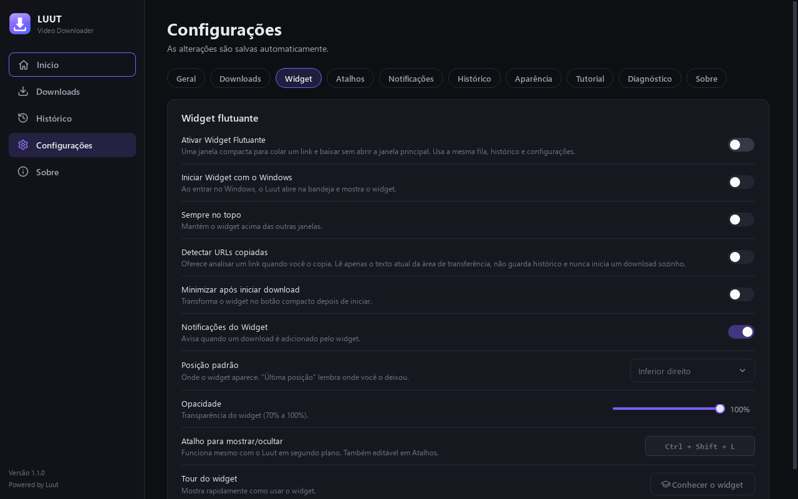
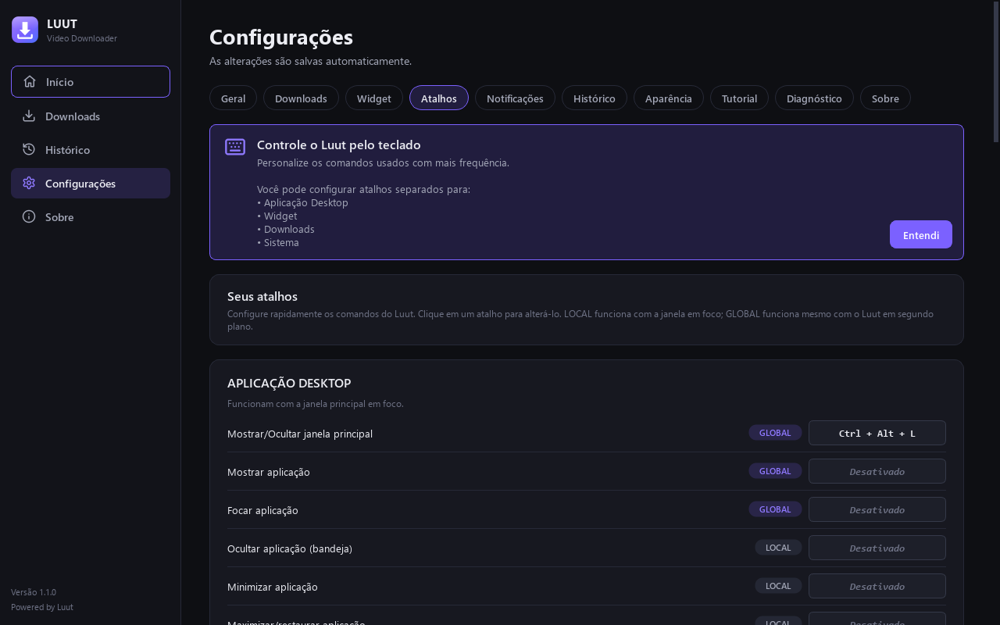

# Luut Video Downloader

Aplicativo desktop para Windows que analisa links de vídeos, mostra as qualidades e formatos realmente
disponíveis e baixa o conteúdo para o computador — com fila, downloads simultâneos, pausa/retomada,
histórico e notificações.

**Powered by Luut**

> O aplicativo trabalha apenas com conteúdo acessível publicamente por meios tecnicamente suportados.
> Não há quebra de DRM, bypass de autenticação/paywall nem uso de cookies do navegador.

---

## Screenshots

| Início | Downloads |
|---|---|
|  |  |

| Histórico | Configurações |
|---|---|
|  |  |

| Tutorial — boas-vindas | Tutorial — spotlight |
|---|---|
|  |  |

| Widget flutuante | Widget — fila |
|---|---|
|  |  |

| Configurações → Widget | Configurações → Atalhos |
|---|---|
|  |  |

---

## Recursos

- Análise de URL em segundo plano: thumbnail, título, autor, duração, qualidade máxima, tamanho estimado e formatos.
  Metadados ausentes aparecem como “Não disponível”.
- Qualidades reais da fonte (Melhor disponível, 2160p, 1440p, 1080p, 720p, 480p, 360p…) — nada é inventado.
- Tipos: **Vídeo + Áudio**, **Vídeo somente** e **Áudio somente** — cada um só aparece quando a fonte realmente
  oferece (vídeo somente exige um stream de vídeo sem áudio; nada é “fingido”).
- Formatos: **MP4** (remux sem recodificação, quando possível) ou **formato original**; para áudio **MP3**, **M4A**
  ou **Original** (MP3/M4A usam o FFmpeg embutido; sem FFmpeg só aparece o stream original).
- Combinação de áudio + vídeo com **FFmpeg embutido**.
- **yt-dlp atualizável sem recompilar o app** (veja [yt-dlp](#yt-dlp-dependência-atualizável)): versão, verificação
  automática a cada 24 h, atualização com checksum oficial, backup e rollback.
- Fila com 1–4 downloads simultâneos, reordenação (topo/cima/baixo), remover, limpar concluídos.
- Progresso real: porcentagem, bytes, velocidade e tempo restante. Quando o tamanho total não é conhecido,
  a barra fica indeterminada (sem porcentagem falsa).
- **Pausar/retomar** reais: a pausa interrompe o download e mantém os dados parciais; a retomada continua do ponto
  em que parou. Se não houver dados parciais, a interface avisa que o download recomeçará do início.
- Cancelamento com remoção dos arquivos temporários.
- 3 tentativas automáticas para falhas de rede (intervalos de 2 s e 5 s) e botão “Tentar novamente”.
- Downloads interrompidos pelo fechamento do app são detectados na próxima abertura (Retomar / Baixar novamente).
- Nomes de arquivo seguros para Windows, sem sobrescrever: `video.mp4`, `video (1).mp4`, `video (2).mp4`…
- Organização automática opcional (Ano/Mês, Ano, Canal ou Site).
- Histórico com busca, filtros (Todos, Concluídos, Cancelados, Falhos), abrir arquivo/pasta, copiar caminho,
  baixar novamente, excluir registro, limpar (com confirmação) e exportar CSV/JSON.
- Vários links de uma vez (um por linha) e importação de lista `.txt`; links inválidos são apontados individualmente.
- Notificações discretas (toast no app / notificação do Windows quando minimizado).
- **Widget flutuante** opcional (veja [Widget](#widget-flutuante)) usando a mesma fila, histórico e configurações.
- **Atalhos configuráveis** locais e globais (veja [Atalhos](#atalhos)).
- Bandeja do sistema: Abrir Luut, Mostrar/Ocultar Widget, Pausar/Retomar todos, Abrir Downloads, Abrir Histórico,
  Configurações, Sair.
- Iniciar com o Windows (e, separadamente, iniciar o widget com o Windows), direto na bandeja.
- Arrastar e soltar links; sugestão não invasiva de usar um link copiado.
- Tema escuro e claro centralizados em tokens (`app/ui/theme.py`).
- Tela de diagnóstico (versões, FFmpeg, espaço em disco, pastas, banco, internet) com ✓ OK / ⚠ Aviso / ✕ Erro.
- Tutorial interativo na primeira execução, com spotlight sobre os elementos reais da interface (veja [Tutorial](#tutorial)).
- Fila persistente e recuperação após fechamento inesperado (veja [Recuperação](#recuperação-e-fila)).
- Estados vazios desenhados para quem ainda não tem nenhum dado.
- Restaurar aplicativo (Configurações → Diagnóstico) e modo limpo `--fresh-start`.
- Instância única: abrir o `.exe` de novo não cria outra fila nem outra conexão com o banco — apenas traz a janela
  existente para frente (`"Luut Video Downloader.exe" --widget` traz o widget).

---

## Widget flutuante

Uma janela compacta do **mesmo processo** (não é outro programa) para iniciar downloads enquanto você navega:

```
Navegador → copiar URL → Ctrl + Shift + L → Ctrl + Shift + V → Ctrl + Shift + Enter (analisar)
          → escolher qualidade/tipo/formato → Ctrl + Shift + Enter (iniciar) → continuar navegando
```

- Vem **desativado**. Ative em **Configurações → Widget → Ativar Widget Flutuante**. Desativado, ele não existe:
  nenhuma janela, nenhum atalho do widget registrado e nenhuma leitura da área de transferência.
- Analisa com o mesmo `Analyzer`, baixa pelo mesmo `DownloadManager` e mostra a mesma fila da janela principal:
  o que for adicionado em um lado aparece no outro na hora.
- Progresso real (porcentagem, baixado/total, velocidade, ETA, estado); o que não é conhecido aparece como “—”.
- **Fila** (botão `↓ Fila N`, onde N = tarefas pendentes) com ações por estado: pausar, retomar, cancelar, abrir pasta,
  abrir arquivo, copiar caminho, baixar novamente, tentar novamente e remover. A fila não tem limite; o widget
  desenha as 60 primeiras e oferece “ver todos no aplicativo”.
- **Minimizar** (`−`) vira um botão compacto `↓ 3` (downloads ativos/aguardando); clique para expandir. Opção de
  minimizar automaticamente após iniciar.
- Arraste por qualquer área vazia. A posição é salva e, se o monitor não existir mais, o widget volta para um
  canto seguro. Posição padrão, sempre no topo e opacidade (70–100%) em Configurações → Widget.
- **Detectar URLs copiadas** (desligado por padrão): mostra “Nova URL detectada” com **Analisar** / **Ignorar**.
  Só lê o texto atual da área de transferência, não guarda histórico, não envia nada e **nunca inicia um download
  sozinho**. URLs nunca vão para os logs.
- Tour guiado (8 etapas) oferecido na primeira ativação; reabrir em Configurações → Widget → Tour do widget.
- O Luut não controla o navegador: sem automação de mouse/teclado, cookies, injeção de scripts ou bypass.

## Atalhos

Todos os atalhos passam pelo `ShortcutManager` (`app/core/shortcuts.py`) e ficam na tabela `shortcuts` do SQLite
com identificadores estáveis (`widget.toggle`, `app.open_history`, `downloads.pause_all`…). Em
**Configurações → Atalhos** eles aparecem separados em **Aplicação desktop**, **Downloads**, **Widget** e
**Sistema**, cada um marcado como **LOCAL** (janela em foco) ou **GLOBAL** (funciona com o Luut em segundo plano).

- Clique no atalho e pressione a nova combinação (`Esc` cancela; `Backspace`/`Delete` desativa).
- Validação: combinação vazia, só modificadores, tecla não suportada, combinações reservadas pelo Windows
  (`Alt+F4`, `Win+D`…), atalhos de edição de texto (`Ctrl+C`…) e atalhos globais genéricos demais
  (globais exigem duas teclas modificadoras). Teclas únicas (`Enter`, `Space`, `Delete`) só em contexto local.
- Conflitos: “Atalho em conflito — já está sendo usado por …  Deseja substituir?”. Dois comandos globais nunca
  compartilham a mesma combinação. Se o Windows recusar um atalho global (outro programa já usa), ele aparece
  como **INDISPONÍVEL**.
- **Restaurar padrões** (com confirmação) só mexe nos atalhos; cada linha também tem “restaurar este atalho”.
- Dicas de atalho nos botões e tooltips acompanham qualquer alteração.

Padrões principais:

| Atalho | Ação | Tipo |
|---|---|---|
| `Ctrl+Shift+L` | Mostrar/Ocultar Widget | GLOBAL |
| `Ctrl+Alt+L` | Mostrar/Ocultar janela principal | GLOBAL |
| `Ctrl+Shift+U` / `Ctrl+Shift+V` | Widget: focar URL / colar URL | LOCAL |
| `Ctrl+Shift+Enter` | Widget: analisar (ou iniciar, quando já analisado) | LOCAL |
| `Ctrl+Shift+Q` / `Ctrl+Shift+M` | Widget: abrir fila / minimizar | LOCAL |
| `Ctrl+Shift+P` / `Ctrl+Shift+R` / `Ctrl+Shift+X` | Widget: pausar / retomar / cancelar download | LOCAL |
| `Ctrl+N`, `Ctrl+L`, `Ctrl+V` | Nova URL, focar URL, colar URL | LOCAL |
| `Enter` / `Ctrl+Enter` | Analisar (no campo URL) / adicionar à fila | LOCAL |
| `Ctrl+1`, `Ctrl+D`, `Ctrl+H`, `Ctrl+,` | Início, Downloads, Histórico, Configurações | LOCAL |
| `Space`, `Delete`, `Ctrl+R` | Pausar/retomar, cancelar/remover, tentar novamente (item selecionado) | LOCAL |
| `Ctrl+Shift+P` / `R` / `C` | Pausar / retomar / cancelar todos | LOCAL |
| `Ctrl+Shift+D`, `Ctrl+Shift+G`, `F1` | Pasta de downloads, logs, tutorial | LOCAL |

---

## Tutorial

Na primeira abertura, o app mostra **Bem-vindo ao Luut Video Downloader** com **Começar tutorial** /
**Pular tutorial**. O tutorial tem 15 etapas: boas-vindas, barra lateral, URL, Analisar, informações do vídeo,
qualidade/formato, pasta (com botão para escolher a pasta padrão), fila, downloads, histórico, configurações,
recuperação, widget, atalhos e conclusão. A primeira visita à aba Atalhos mostra uma introdução (“Entendi”).

- Cada etapa escurece a janela e destaca o componente real (spotlight). O balão muda de lado sozinho e nunca
  sai da tela (testado em 1366×768, 1920×1080 e 2560×1440).
- Navegação: **Próximo**, **Voltar**, **Pular**, **×** (Fechar), teclas ← / → / Enter / Esc, progresso
  "Etapa X de 15" e bolinhas.
- **Não mostrar este tutorial novamente** aparece em todas as etapas. Pular sem marcar essa opção faz o
  tutorial aparecer de novo na próxima abertura; concluir não mostra mais.
- Reabrir: **Configurações → Ajuda / Tutorial → Iniciar tutorial novamente**, ou **Sobre → Ver tutorial**.
- Os exemplos mostrados (vídeo e card de download) têm a etiqueta **Demonstração/Exemplo**, existem só na tela
  e somem ao terminar. Nada é gravado no banco, no histórico ou nas estatísticas.
- Para acrescentar uma etapa, basta incluir um `TutorialStep` em `app/core/services/tutorial.py`
  (id, título, descrição, alvo, posição, ordem, se pode pular) e registrar o alvo em
  `MainWindow._tutorial_targets()`.

## Recuperação e fila

- A fila não tem limite de tamanho: 10, 100 ou 500 itens. Só a quantidade de **downloads simultâneos** (1 a 4) é
  controlada; o resto aguarda na ordem.
- Tudo fica no SQLite: fila, status, posição e progresso. O progresso é salvo a cada ~3 s e também ao
  pausar, cancelar, falhar, concluir ou mudar de estado.
- Enquanto baixa, os dados ficam em arquivos `.part` na pasta temporária. O arquivo final só é criado quando o
  download termina de verdade: primeiro ele é gravado como `nome.mp4.part` na pasta de destino e depois
  renomeado de forma atômica para `nome.mp4`. Um arquivo incompleto nunca é marcado como concluído.
- Se o app fechar no meio (crash, Windows reiniciou, falta de energia), na próxima abertura:
  o que estava baixando vira **interrompido**, o que aguardava continua **aguardando** na mesma ordem, e aparece
  *"Encontramos downloads interrompidos"* com **Retomar todos**, **Revisar** (a fila fica pausada, com o botão
  "Retomar fila") ou **Descartar**.
- Ao retomar, o download continua a partir do `.part` quando a fonte permite. Se a fonte não permitir, o card
  avisa que o download recomeçou do início.
- Fechar com downloads ativos oferece: **Continuar em segundo plano**, **Pausar e sair**, **Cancelar e sair** ou
  **Voltar**.

## Modo limpo (`--fresh-start`) e reset

```bat
"Luut Video Downloader.exe" --fresh-start
```

Abre o app como se nunca tivesse sido usado: banco novo, fila e histórico vazios, configurações padrão e
tutorial. Ele usa um perfil **separado** (`%LOCALAPPDATA%\LuutVideoDownloader-FreshStart`), recriado do zero a
cada execução. Os dados reais e os vídeos baixados não são lidos nem alterados. O título da janela mostra
"modo limpo". Em desenvolvimento: `python run.py --fresh-start`.

**Restaurar aplicativo** (Configurações → Diagnóstico) pede uma confirmação forte e apaga só os dados
internos: banco (histórico, fila, configurações, atalhos e tutorial), thumbnails, temporários, cache e logs, e
remove a inicialização com o Windows. Os vídeos já baixados continuam nas suas pastas. Depois o app reinicia como na
primeira vez (flag interna `--reset-data`).

## yt-dlp (dependência atualizável)

O mecanismo de download é o **`yt-dlp.exe` oficial**, executado como processo separado. Ele não fica mais dentro do
`Luut Video Downloader.exe`, então uma nova versão do yt-dlp é instalada pelo próprio app — sem baixar ou recompilar
o Luut.

**Onde fica**

| Local | Papel |
|---|---|
| `%LOCALAPPDATA%\LuutVideoDownloader\bin\yt-dlp.exe` | Cópia gerenciada: é a que roda, é atualizada e restaurada aqui (sempre gravável, sem administrador) |
| `<pasta do Luut Video Downloader.exe>\bin\yt-dlp.exe` | Semente opcional que acompanha o build/instalador; copiada para a pasta acima na primeira execução e nunca alterada |

Só esses dois locais são considerados (nada de procurar no PATH ou no disco). Todo o app usa o caminho devolvido por
`YtDlpManager.get_executable_path()`: janela principal, widget, diagnóstico e autoteste compartilham a mesma
instalação. Em desenvolvimento a semente é `bin\yt-dlp.exe` na raiz do projeto (`python tools\fetch_ytdlp.py bin`).

**Versão** — sempre confirmada executando `yt-dlp.exe --version` (resultado guardado em memória enquanto o arquivo não
mudar). O banco guarda só `ytdlp_last_check`, `ytdlp_latest_known` e a versão dispensada, nunca a "versão instalada".
Comparação numérica (`2026.9` < `2026.10`, sufixo de nightly considerado).

**Verificação** — fonte oficial `api.github.com/repos/yt-dlp/yt-dlp/releases/latest`; se a API falhar (rate limit,
mudança), usa o redirecionamento de `github.com/yt-dlp/yt-dlp/releases/latest`. Timeout de 20 s, só HTTPS e só hosts
do GitHub (redirecionamentos para outros hosts são recusados). Estados: `UP_TO_DATE`, `UPDATE_AVAILABLE`,
`NOT_INSTALLED`, `CHECK_FAILED`. Automática no máximo a cada 24 h (discreta: só um toast "↑ Atualização disponível");
o botão **Verificar atualizações** ignora o intervalo. Offline não é erro: o app continua com a versão atual.

**Atualização** (`YtDlpManager.install`):

```
downloads ativos? ── sim ──> bloqueia ("Não é possível atualizar o yt-dlp agora…"; opcional: instalar ao terminar)
   │ não
baixa yt-dlp.exe.download (progresso, cancelável) ─> renomeia para yt-dlp.new.exe
   ─> valida: tamanho plausível, cabeçalho MZ, SHA-256 do SHA2-256SUMS oficial, `--version` == versão da release
   ─> espera nenhum processo yt-dlp em uso (lease) ─> yt-dlp.exe -> yt-dlp.exe.backup ─> yt-dlp.new.exe -> yt-dlp.exe
   ─> `yt-dlp.exe --version` == nova versão?  sim -> apaga backup   /   não -> ROLLBACK
```

**Rollback** — se a troca ou o `--version` depois da troca falhar, o arquivo novo é removido e o backup volta a ser
`yt-dlp.exe` ("A atualização falhou. A versão anterior do yt-dlp foi restaurada."). Se o app fechar no meio da troca,
na próxima abertura `recover_interrupted_install()` restaura o backup e apaga temporários. Um arquivo inválido nunca é
executado antes do checksum conferir, e nunca substitui uma versão que funciona.

**Processos** — cada execução do yt-dlp roda num *Job Object* do Windows: pausar/cancelar encerra a árvore inteira
(o yt-dlp.exe oficial cria um processo filho) e um fechamento inesperado do Luut não deixa yt-dlp rodando. Como cada
download inicia um processo novo, a versão recém-instalada já é usada no próximo download, sem reiniciar o Luut.

**Configurações → Atualizações** — versão do Luut e do yt-dlp (clique na versão para detalhes: última verificação,
status, fonte, caminho), status (✓ Atualizado, ↑ Atualização disponível, ⟳ Verificando..., ↓ Baixando atualização...,
⟳ Instalando..., ! Não foi possível atualizar, ! yt-dlp não instalado), **Verificar atualizações**, **Atualizar agora**
/ **Instalar yt-dlp**, barra de progresso com **Cancelar** e as opções:

| Opção | Padrão |
|---|---|
| Verificar atualizações automaticamente | ligado |
| Perguntar antes de instalar atualizações | ligado (desligado = instala sozinho, só com a fila parada) |
| Atualizar automaticamente quando os downloads terminarem | desligado |

"Depois" no aviso de nova versão não pergunta de novo nesta sessão nem para a mesma versão. Primeira execução sem
yt-dlp: diálogo "yt-dlp não encontrado — Baixar yt-dlp" e um aviso fixo na página Início até instalar. Sobre e
Diagnóstico mostram a versão, se foi encontrado, o caminho, a última verificação e se há atualização.

**Suporte sem interface** (mesmo código do app):

```bat
"Luut Video Downloader.exe" --ytdlp-status C:\Temp\ytdlp.json
"Luut Video Downloader.exe" --ytdlp-update C:\Temp\ytdlp.json            &rem última versão oficial
"Luut Video Downloader.exe" --ytdlp-update C:\Temp\ytdlp.json 2026.08.19 &rem versão oficial específica (reparo)
```

**Como testar uma atualização** — instale uma versão antiga com `--ytdlp-update <json> <versão antiga>`, abra o app
(ou use Configurações → Atualizações → Verificar atualizações) e clique em **Atualizar agora**; confira em Sobre ou
com `--ytdlp-status`. Os testes automáticos (`tests/test_ytdlp_updates.py`) cobrem atualizado, versão antiga, ausente,
offline, download ativo, download interrompido, arquivo inválido, rollback, sucesso, persistência e widget.

## Configurações

Abas: **Geral** (iniciar com o Windows, minimizado, bandeja), **Downloads** (pasta padrão, downloads simultâneos
1–4, arquivos existentes, organização, pasta temporária), **Widget**, **Atalhos**, **Notificações** (iniciado,
concluído com “Abrir arquivo”, falha com “Tentar novamente”), **Histórico**, **Aparência**, **Tutorial**,
**Diagnóstico** (verificação, logs, restaurar aplicativo), **Atualizações** (yt-dlp) e **Sobre**. Tudo é salvo na hora e lido pelo mesmo
`SettingsManager` — a janela principal e o widget nunca têm configurações paralelas.

## Requisitos

- Windows 10 ou 11 (64 bits)
- Para desenvolvimento/build: Python 3.11+ (testado com 3.13)
- Opcional: [Deno](https://deno.com) no PATH libera todos os formatos do YouTube (o yt-dlp o utiliza
  automaticamente). Sem ele, alguns formatos podem não aparecer.

## Instalação (desenvolvimento)

```bat
python -m venv .venv
.venv\Scripts\python -m pip install -r requirements-dev.txt
```

## Execução

```bat
.venv\Scripts\python run.py
```

## Testes

```bat
.venv\Scripts\python -m pytest
```

Os testes de rede (downloads reais pelo yt-dlp + FFmpeg) são opcionais:

```bat
set LUUT_NETWORK_TESTS=1
.venv\Scripts\python -m pytest tests\test_network_e2e.py
```

## Build do executável

```bat
build.bat
```

O script cria/valida o ambiente virtual, instala dependências, executa os testes, prepara o ícone e o FFmpeg, roda o
PyInstaller com `Luut Video Downloader.spec` (modo janela, sem console), coloca o `yt-dlp.exe` oficial verificado em
`dist\bin\` (`tools\fetch_ytdlp.py`, mesmo `YtDlpManager` do app) e confere que nenhum banco, log, teste, screenshot ou arquivo temporário
foi parar dentro do executável (`tools/verify_bundle.py`). Resultado:

```
dist\
├── Luut Video Downloader.exe     (Python, Qt e FFmpeg embutidos — o yt-dlp NÃO)
└── bin\yt-dlp.exe                (semente; o app o copia para o perfil e o atualiza lá)
```

Distribua a pasta inteira (ou o instalador). Se só o `.exe` for copiado, o app oferece baixar o yt-dlp na primeira
execução. O `tools/verify_bundle.py` falha o build se o módulo `yt_dlp` aparecer dentro do executável.

Autoteste do executável (análise + download real, gera `self-test.json` na pasta indicada):

```bat
"dist\Luut Video Downloader.exe" --self-test https://www.youtube.com/watch?v=jNQXAC9IVRw C:\Temp\luut-teste
```

Instalador (opcional): `packaging\installer.iss` para o [Inno Setup 6](https://jrsoftware.org/isinfo.php).

---

## Build para macOS (.dmg)

O instalador de Mac só pode ser gerado **em um macOS** (o PyInstaller não faz compilação cruzada). Duas opções:

**GitHub Actions (recomendado):** o workflow `.github/workflows/build-mac.yml` roda em cada push na `main`, em pull
requests e manualmente (aba *Actions* → *Build macOS* → *Run workflow*). Ele gera
`LuutVideoDownloader-<versão>-macOS-arm64.dmg`, para Macs com **Apple Silicon** (M1 ou mais novo).

**Macs Intel não são suportados:** o `yt-dlp_macos` oficial só traz o Python para ARM (a parte Intel do arquivo é
apenas o inicializador), e o yt-dlp não publica outro executável para Mac Intel.

Os `.dmg` ficam em *Artifacts* na página da execução. Ao enviar uma tag `v*` (ex.: `git tag v1.3.0 && git push --tags`),
eles também são anexados à Release do GitHub.

**Em um Mac com Apple Silicon:** `bash build_mac.sh` (Python 3.13). O script instala as dependências, roda os testes, gera o ícone
`.icns` e o FFmpeg, baixa o `yt-dlp_macos` oficial verificado, roda o PyInstaller com
`Luut Video Downloader macOS.spec`, confere o pacote, faz um teste rápido do app (acha e executa o yt-dlp embutido) e
cria o `.dmg` em `dist/`.

```
Luut Video Downloader.app/Contents/
├── MacOS/Luut Video Downloader      (Python e Qt)
├── Frameworks/ffmpeg/ffmpeg         (FFmpeg embutido)
└── Resources/bin/yt-dlp_macos       (semente; o app o copia para o perfil e o atualiza lá)
```

### Instalar no Mac (app sem assinatura da Apple)

1. Abra o `.dmg` e arraste **Luut Video Downloader** para **Aplicativos**.
2. Na primeira abertura o macOS avisa que não pode verificar o desenvolvedor. Feche o aviso e vá em
   **Ajustes do Sistema → Privacidade e Segurança → "Abrir Mesmo Assim"** (no macOS 14 ou anterior também funciona
   clicar com o botão direito no app → **Abrir**).
3. Alternativa pelo Terminal: `xattr -dr com.apple.quarantine "/Applications/Luut Video Downloader.app"`

### Diferenças no macOS

- Dados em `~/Library/Application Support/LuutVideoDownloader` (no lugar de `%LOCALAPPDATA%`).
- Pasta padrão de downloads: `~/Movies` (ou `~/Downloads`).
- "Iniciar com o macOS" usa um LaunchAgent em `~/Library/LaunchAgents/com.luut.LuutVideoDownloader.plist`. Use o app
  instalado em **Aplicativos**: o LaunchAgent aponta para o local de onde o app foi aberto.
- **Atalhos globais estão desativados** (aparecem como *Indisponível*); os atalhos com a janela em foco funcionam
  normalmente, com ⌘ no lugar de Ctrl.
- Clicar no ícone do Dock com o app só na barra de menus reabre a janela principal.
- Para o Deno (todos os formatos do YouTube), instale com `brew install deno`. O app procura em `/opt/homebrew/bin`,
  `/usr/local/bin` e `~/.deno/bin`.

---

## Arquitetura

```
run.py                      # launcher (dev e PyInstaller)
app/
  main.py                   # bootstrap: logging, banco, tema, instância única, janela, --autostart/--widget
  self_test.py              # --self-test headless
  core/                     # regras de negócio — sem Qt
    errors.py               # categorias de erro + mensagens amigáveis
    events.py               # EventBus: download_added/started/progress/paused/resumed/completed/failed/
                            #           cancelled/removed, queue_changed, analysis_started/completed/failed
    shortcuts.py            # ShortcutManager: ações, validação, conflitos, persistência, despacho
    services/ytdlp_manager.py  # YtDlpManager: localizar, versão, fonte oficial, instalar, validar, backup, rollback
    services/updates.py     # UpdateManager (app + YtDlpUpdater): intervalo de 24 h, bloqueio com downloads, "Depois"
    models/                 # VideoInfo, DownloadTask/Status/Progress, AppSettings
    providers/
      base.py               # DownloadProvider (analyze/download) + StopToken (pause/cancel)
      ytdlp_provider.py     # implementação com yt-dlp.exe (processo) + FFmpeg
    managers/
      download_manager.py   # fila, concorrência, retentativas, pausa/retomada, persistência
      settings_manager.py
    services/
      analyzer.py           # validação + análise + thumbnail
      history.py            # repositório SQLite + exportação CSV/JSON
      thumbnails.py         # cache local de thumbnails
      diagnostics.py
      tutorial.py           # TutorialStep, TutorialManager, estado persistido
      update_service.py     # preparado para verificação futura de atualizações
  system/                   # integração com o Windows
    global_hotkeys.py       # RegisterHotKey (WM_HOTKEY), sincronizado com o ShortcutManager
    clipboard_monitor.py    # detecção opcional de URL copiada (evento, sem polling)
    autostart.py            # HKCU\...\Run (iniciar com o Windows)
    single_instance.py      # segunda execução -> comando para a instância aberta
  infrastructure/
    database.py             # SQLite (downloads, settings, tutorial_state, shortcuts) + migrações
    filesystem.py           # espaço em disco, permissões, destino final, abrir arquivo/pasta
    logger.py               # app.log, downloads.log, errors.log (com remoção de tokens)
    tools.py                # localização do FFmpeg/Deno
    processes.py            # processos filhos em Job Object (pausar/cancelar encerra a árvore inteira)
    app_data.py             # reset seguro e perfil --fresh-start
  ui/                       # PySide6
    theme.py                # tokens de cor + stylesheet
    bridge.py               # eventos do DownloadManager/EventBus -> sinais Qt (thread-safe)
    shortcuts.py            # ShortcutBinder (QShortcut a partir do manager), captura de teclas
    floating_widget.py      # widget flutuante + botão compacto (vidro fumê)
    widget_controller.py    # ciclo de vida do widget, posição/multi-monitor, clipboard, tour
    widget_tour.py          # tour do widget
    ytdlp_updates.py        # controlador Qt das atualizações do yt-dlp (background, progresso, avisos)
    main_window.py, tray.py, task_actions.py, workers.py, icons.py
    pages/                  # Início, Downloads, Histórico, Configurações, Sobre
    widgets/                # sidebar, cards, barra de progresso animada, toggle, toasts…
    dialogs/                # vários links, diagnóstico, confirmação
    tutorial/               # TutorialOverlay (spotlight + balão) e TutorialController
  utils/                    # urls, nomes de arquivo, formatação, caminhos
assets/                     # ícones SVG, logo, app.ico
tests/                      # pytest (core, UI offscreen, rede opcional)
packaging/                  # version info do .exe e script do instalador
tools/                      # geração do ícone e preparação do build
```

Fluxo: `Janela principal / Widget → DownloadManager → DownloadProvider → yt-dlp`. As duas interfaces são só
“cascas” sobre o mesmo núcleo (um `AppContext` por processo) e reagem aos mesmos eventos — nada consulta o estado em
loop. A interface nunca conhece o mecanismo; trocar ou adicionar um mecanismo é implementar `DownloadProvider`.

Toda operação demorada (análise, thumbnails, downloads, diagnóstico, vários links) roda fora da thread da interface.

---

## Onde ficam os dados

| Item | Local |
|---|---|
| Banco (histórico, fila, configurações, estado do tutorial) | `%LOCALAPPDATA%\LuutVideoDownloader\luut.db` |
| Logs | `%LOCALAPPDATA%\LuutVideoDownloader\logs\` (`app.log`, `downloads.log`, `errors.log`) |
| Arquivos parciais | `%LOCALAPPDATA%\LuutVideoDownloader\temp\` (configurável) |
| Thumbnails | `%LOCALAPPDATA%\LuutVideoDownloader\thumbnails\` |
| yt-dlp (atualizável) | `%LOCALAPPDATA%\LuutVideoDownloader\bin\yt-dlp.exe` |
| Cache | `%LOCALAPPDATA%\LuutVideoDownloader\cache\` |
| Perfil do modo limpo | `%LOCALAPPDATA%\LuutVideoDownloader-FreshStart\` |

O caminho vem da variável `LOCALAPPDATA` do Windows (nada fica fixo no código), e nunca é a pasta do executável.
As configurações ficam na tabela `settings` do mesmo banco SQLite, em vez de um `settings.json` separado, para que
tudo seja gravado de forma atômica. Tabelas: `downloads`, `settings`, `tutorial_state` (tutorial, tour do widget,
introdução dos atalhos) e `shortcuts` (`action_id`, `scope`, `key_combination`, `enabled`, `is_global`,
`updated_at`).

A pasta de logs também abre por **Configurações → Diagnóstico → Logs**.
Os logs nunca registram senhas, tokens, cookies nem o conteúdo da área de transferência; as URLs de vídeos aparecem
só com o domínio (`https://site.com/…`).

---

## Solução de problemas

| Sintoma | O que fazer |
|---|---|
| “Não foi possível analisar este link.” | O site não é suportado ou o link não aponta para um vídeo. |
| “Não foi possível acessar este conteúdo.” | Vídeo privado, removido, restrito por região/idade ou exige login. |
| Poucas qualidades no YouTube | Instale o Deno (veja Requisitos) e reinicie o app. |
| “A conexão foi interrompida.” | Verifique a internet; o app tenta 3 vezes e depois oferece “Tentar novamente”. |
| “Não há espaço suficiente…” | Libere espaço ou escolha outro disco. |
| “…não possui permissão para salvar nesta pasta.” | Escolha uma pasta do seu usuário (ex.: Vídeos). |
| Atalho global marcado como INDISPONÍVEL | Outro programa já usa a combinação; escolha outra em Configurações → Atalhos. |
| O atalho do widget não faz nada | Ative o widget (Configurações → Widget); com ele desativado os atalhos dele não existem. |
| Widget sumiu da tela | Use `Ctrl+Shift+L` ou a bandeja → Mostrar Widget; se o monitor foi desconectado ele volta para um canto seguro. |
| “Nova URL detectada” não aparece | Ative “Detectar URLs copiadas”; links copiados pelo próprio Luut são ignorados. |
| Iniciar com o Windows não funciona no modo limpo | É proposital: o perfil `--fresh-start` nunca se registra na inicialização. |
| “Não foi possível localizar o yt-dlp.” | Configurações → Atualizações → Instalar yt-dlp (ou `--ytdlp-update`). |
| “Não foi possível verificar atualizações.” | Sem internet ou GitHub indisponível; o app segue com a versão atual. |
| “Não é possível atualizar o yt-dlp agora.” | Há downloads em andamento; atualize depois ou ligue “Atualizar quando os downloads terminarem”. |
| “A atualização falhou. A versão anterior…” | O rollback já restaurou a versão anterior; tente de novo mais tarde e veja `app.log`. |
| Algo inesperado | Configurações → Diagnóstico → Verificar sistema; envie o relatório e `errors.log`. |

---

## Licença e créditos

© 2026 Luut.

- [Python](https://www.python.org) — PSF License
- [PySide6 / Qt](https://www.qt.io/qt-for-python) — LGPLv3
- [yt-dlp](https://github.com/yt-dlp/yt-dlp) — Unlicense (executável oficial, distribuído e atualizado separadamente)
- [FFmpeg](https://ffmpeg.org) — LGPL/GPL (o binário embutido vem do pacote `imageio-ffmpeg`)
- [Lucide](https://lucide.dev) — ícones, ISC License
- SQLite — domínio público
